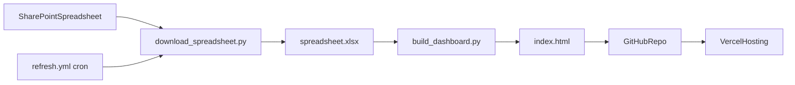

# Apex Dashboard

Static mortgage dashboard built from a SharePoint spreadsheet and published as `index.html`.

## What This Repository Does

- Downloads `Loan Pipeline Checklist.xlsx` from SharePoint.
- Extracts and normalizes dashboard data from workbook sheets.
- Injects data into `dashboard_template.html` and generates `index.html`.
- Auto-refreshes the live dashboard on weekdays via GitHub Actions.

## Architecture



## Repository Files

- `download_spreadsheet.py`: fetches spreadsheet from SharePoint using app credentials.
- `build_dashboard.py`: parses workbook sheets and renders `index.html` from `dashboard_template.html`.
- `dashboard_template.html`: dashboard layout, charts, filters, and client upload flow.
- `.github/workflows/refresh.yml`: scheduled rebuild/publish workflow.
- `.github/workflows/build-test.yml`: CI smoke build using a fixture workbook (no SharePoint).
- `tests/fixtures/build_minimal_xlsx.py`: generates a tiny `.xlsx` for local/CI builds.
- `index.html`: **generated** — edit `dashboard_template.html` and run `build_dashboard.py`; do not hand-edit `index.html`.

## Prerequisites

- Python `3.11+`
- `pip`
- SharePoint app credentials:
  - `SHAREPOINT_CLIENT_ID`
  - `SHAREPOINT_CLIENT_SECRET`
- GitHub repository with Actions enabled and permission to push commits from workflow.

## Run locally (before Vercel)

You only need a browser and a generated `index.html`. Two ways to produce it:

### Option A — Fixture spreadsheet (no SharePoint)

From the repository root:

```powershell
cd C:\Users\RayAnthonySolis\Projects\apex-dashboard
python -m pip install --upgrade pip
pip install -r requirements.txt
python tests\fixtures\build_minimal_xlsx.py
python build_dashboard.py --spreadsheet tests\fixtures\minimal.xlsx
python -m http.server 8080
```

Open **http://localhost:8080/index.html** (use the URL bar path explicitly if the directory index lists files instead of opening the dashboard).

### Option B — Real SharePoint file

```powershell
# One-time setup:
copy .env.example .env
# Edit .env with your real values
python download_spreadsheet.py
python build_dashboard.py
python -m http.server 8080
```

Same URL as above.

### Deploy checklist

1. Confirm the dashboard looks right at `http://localhost:8080/index.html`.
2. Commit **`dashboard_template.html`** and any script changes; commit **`index.html`** after a real `build_dashboard.py` run when you want the repo to match production data (scheduled workflow also regenerates and commits `index.html`).
3. In Vercel: connect the repo, production branch, no build command; output is the repo root so `index.html` is the entry.

---

## Local Setup

### 1) Install dependencies

```powershell
python -m pip install --upgrade pip
pip install -r requirements.txt
```

### 2) Set environment variables

PowerShell:

```powershell
$env:SHAREPOINT_CLIENT_ID="your-client-id"
$env:SHAREPOINT_CLIENT_SECRET="your-client-secret"
```

Or use a local `.env` file (recommended for local dev, ignored by git):

```powershell
copy .env.example .env
# then edit .env and run scripts normally
```

Optional cert rotation reminder (local metadata, no key parsing):

```powershell
# YYYY-MM-DD
$env:SHAREPOINT_CERT_EXPIRES_ON="2028-04-10"
# days-before-expiry warning threshold (default 30)
$env:SHAREPOINT_CERT_WARN_DAYS="30"
```

Optional certificate auth (script attempts this first when set):

```powershell
$env:SHAREPOINT_CERT_PATH="C:\Users\RayAnthonySolis\Projects\apex-dashboard\certs\apex-dashboard-sp-private-key.pem"
$env:SHAREPOINT_CERT_THUMBPRINT="your-cert-thumbprint-from-azure"
# optional; defaults from SharePoint hostname prefix
$env:SHAREPOINT_TENANT_ID="apexfunding"
```

`SHAREPOINT_CERT_PATH` must point to a **PEM-encoded private key** file (not `.cer` and not `.pfx`).
If cert auth is not configured (or initialization fails), script falls back to client-secret auth.

To create the PEM private key from your `.pfx`:

```powershell
python -m pip install cryptography
python convert_pfx_to_pem.py --pfx certs\apex-dashboard-sp-private.pfx --out-dir certs
```

Then set:

```powershell
$env:SHAREPOINT_CERT_PATH="C:\Users\RayAnthonySolis\Projects\apex-dashboard\certs\apex-dashboard-sp-private-key.pem"
```

Optional (enables username/password prompt before **Upload Data** in the built `index.html`):

```powershell
$env:DASHBOARD_UPLOAD_USER="your-uploader-login"
$env:DASHBOARD_UPLOAD_PASSWORD="your-shared-secret"
```

If these are unset, the upload button works without a login (local preview only; it does not publish). **Caution:** values are embedded in the generated HTML—acceptable only for a low-risk internal link; prefer a server-side gate for stronger security.

### 3) Download source spreadsheet

```powershell
python download_spreadsheet.py
```

Expected output includes attempted SharePoint paths and a success message writing `spreadsheet.xlsx`.

### 4) Build dashboard

```powershell
python build_dashboard.py
```

Optional arguments:

```powershell
python build_dashboard.py --spreadsheet path\to\file.xlsx --template dashboard_template.html --output index.html
```

Data is read from sheets configured by environment (defaults shown):

| Variable | Default |
|----------|---------|
| `DASHBOARD_PRIMARY_FUNDED_YEAR` | `2026` |
| `DASHBOARD_SHEET_PIPELINE` | `Loan Pipeline` |
| `DASHBOARD_SHEET_FUNDED_PRIMARY` | `Apex Funded {year}` |
| `DASHBOARD_SHEET_FUNDED_PRIOR` | `Apex Funded {year-1}` |

Set `BUILD_VERBOSE=1` to print samples of date cells that failed strict parsing during build.

JSON keys `funded2026` / `funded2025` still mean **primary** and **prior** funded books; `primaryYear` and `meta` sheet names keep the UI and upload preview in sync when you change the book year.

### 5) Run/view locally

You can open `index.html` directly, or serve it:

```powershell
python -m http.server 8080
```

Then browse to `http://localhost:8080/index.html`.

## Scheduled Auto-Refresh (Weekdays)

Workflow: `.github/workflows/refresh.yml`

Configured schedule (UTC; GitHub does not support `America/Chicago` directly):

- `0 15 * * 1-5` → **9:00 AM** during **CST** (`15:00 UTC`); in **CDT** this fires at **10:00 AM** local.
- `0 18 * * 1-5` → **12:00 PM CST** (`18:00 UTC`) / **1:00 PM CDT**.
- `0 22 * * 1-5` → **4:00 PM CST** (`22:00 UTC`) / **5:00 PM CDT**.

If you need the same **local** wall times in summer, add parallel cron lines at `14:00`, `19:00`, and `21:00` UTC (and de-duplicate commits when both fire), or accept seasonal drift and document it for the team.

The workflow:

1. Checks out repo
2. Installs Python deps
3. Downloads spreadsheet
4. Rebuilds `index.html`
5. Commits/pushes if `index.html` changed

Manual trigger is available through `workflow_dispatch`.

## Required GitHub Secrets

Set these in repository settings:

- `SHAREPOINT_CLIENT_ID`
- `SHAREPOINT_CLIENT_SECRET`

Optional (upload gate in the built dashboard):

- `DASHBOARD_UPLOAD_USER`
- `DASHBOARD_UPLOAD_PASSWORD`

Optional (notify if the refresh job fails — set in repo secrets):

- `SLACK_WEBHOOK_URL` (incoming webhook; if unset, the workflow skips the curl step)

## Deploy to Vercel

This is a static-site deployment pattern where GitHub Actions updates `index.html`, and Vercel serves the latest commit.

### Recommended setup

1. Import this repository into Vercel.
2. Framework preset: `Other`.
3. Build command: leave empty.
4. Output directory: leave empty (root serves `index.html`).
5. Enable automatic deploys on push to your production branch.

### Operational model

- GitHub Action (`refresh.yml`) is the source-of-truth for **when the public site changes**: it runs on the weekday schedule (and can be run manually via `workflow_dispatch` when needed).
- Each run that produces a new `index.html` commits and pushes; Vercel auto-redeploys from that push.
- **Intended product behavior:** people with the shared link see new numbers **only after** one of those refreshes has run—not immediately when someone uploads or saves the spreadsheet (see **Known Issue / Next Steps**).

## Operations Runbook

### If refresh fails

1. Open latest failed Action run in `refresh.yml`.
2. Check credential errors from `download_spreadsheet.py`.
3. Verify SharePoint file path still matches one of the attempted paths.
4. Re-run job via `workflow_dispatch`.
5. If push failed due to branch divergence/non-fast-forward, rerun after branch is up to date.

### If dashboard data looks stale

1. Confirm latest workflow run status and timestamp.
2. Confirm a new commit with updated `index.html` exists.
3. Confirm Vercel deployed latest commit.
4. Hard-refresh browser cache.

## Reliability and Security Scan (Prioritized)

### Critical

1. **Stored XSS risk from unsanitized HTML rendering**
   - Spreadsheet fields are injected via template string + `innerHTML` patterns.
   - Impact: untrusted content can execute JavaScript in user browsers.
   - Fix: replace string-based row rendering with DOM node creation (`textContent`) or explicit escaping/sanitization utility everywhere data is rendered.

2. **Client-side GitHub token handling and direct repo writes** *(addressed in code: PAT / browser commit removed; live data = scheduled workflow only.)*
   - Residual: optional static username/password gate is embeddable in HTML if enabled at build time.
   - For strong access control, move upload/auth to a server-side endpoint (or GitHub App / workflow dispatch).

### High

3. **Funded table column mismatch** *(fixed in template + current `index.html`)*
   - Funded rows now include the `Processor` column to match headers.

4. **Hardcoded repo target in upload commit** *(obsolete: client-side commit removed.)*
   - Any future server-side publish should use repo config + secrets in CI only.

### Medium

5. **Hardcoded month/year assumptions in KPIs/charts**
   - Monthly charting and KPI labels include fixed month values.
   - Impact: stale or misleading analytics after month rollover.
   - Fix: derive active month/range from current date and dynamic labels.

6. **Workflow push robustness**
   - Push step can fail on non-fast-forward in concurrent update scenarios.
   - Fix: add pull/rebase/retry logic before push.

7. **Date parsing resilience**
   - Some parsing paths silently return `None` for unexpected string formats.
   - Impact: missing values can skew metrics/status buckets.
   - Fix: strict validation + logging for rejected rows; optionally normalize with robust parser.

### Low

8. **Unpinned Python dependencies in CI**
   - Impact: upstream dependency changes can break scheduled jobs.
   - Fix: pin versions in requirements and use lock/constraints.

9. **Credential metadata in logs**
   - Script prints partial client ID.
   - Fix: remove non-essential credential logging from CI output.

## Known Issue / Next Steps

### 1) Keep Current Upload Process + Auto Refresh

Known issue today:

- Upload updates the uploader's screen immediately, but other users with the link may not see changes until a refresh/deploy cycle.
- Current workflow depends on manual action patterns (Manny uploads data every morning; others manually refresh).

Planned direction:

- Keep Manny's upload process (data lands in SharePoint—or an equivalent source—the uploader can work anytime).
- **Public dashboard updates:** everyone with the link sees those upload-driven changes **only** when the scheduled job runs—not on every save or upload. That removes pressure for viewers to manually refresh all day; they can expect fresh data at the next window.
- Required windows (already configured): weekdays at `9 AM CST (15:00 UTC)`, `12 PM CST (18:00 UTC)`, and `4 PM CST (22:00 UTC)`. No additional cron windows are required beyond these three.

**Target behavior (upload + hosting):** Manny (or an authenticated uploader) can update the spreadsheet at any time. The workflow that downloads from SharePoint, runs `build_dashboard.py`, commits `index.html`, and triggers a Vercel production deploy should align with the **schedule above** (plus `workflow_dispatch` for emergencies). Viewers do not depend on a manual “Redeploy” in Vercel; they **do** depend on the clock—**no** always-on “push live immediately after upload” path for the shared URL.

### 2) Deploy on Vercel

- Use Vercel as static host for `index.html`.
- Let Vercel redeploy when the refresh workflow pushes an updated `index.html` (scheduled runs, not ad-hoc upload commits to production).

### 3) Secure Upload Access (User/Password Before Upload)

Current upload button is effectively trust-based and token-driven. For production access control:

- Preferred: remove browser PAT flow entirely.
- Add protected backend endpoint (or Vercel serverless function) requiring authenticated user/password (or SSO) before accepting spreadsheet upload.
- Endpoint validates file and triggers server-side regeneration + publish workflow.
- Restrict uploader role to approved users only; log uploader identity and upload timestamp.

## Suggested Implementation Order

1. Remove client-side PAT flow and move publish server-side. **Done:** browser GitHub commits removed; live updates rely on `refresh.yml`. Optional username/password gate at build time (see Local Setup).
2. Fix XSS surface by eliminating unsafe HTML injection from dataset values. **Done:** `escapeHtml()` on user-provided fields rendered via HTML strings.
3. Correct funded table column alignment. **Done:** Processor column matches headers.
4. Make month/year calculations dynamic. **Done:** overview lender-month chart and pipeline KPI month label; overview avg-rate guard.
5. Harden CI dependency and push reliability. **Done:** `requirements.txt` pins; `git pull --rebase` before `git push`; `contents: write` permission.

